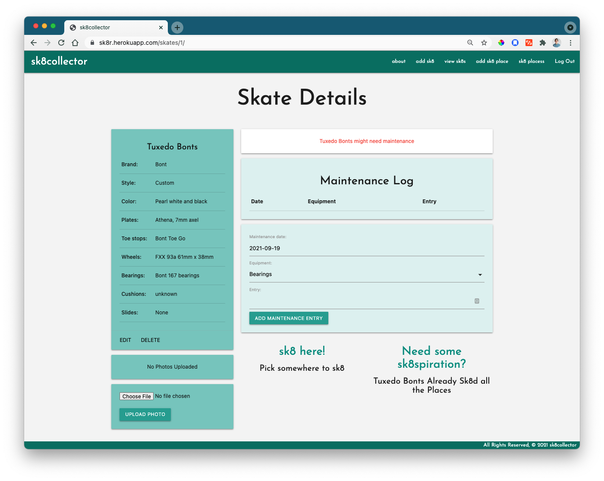

# Welcome, skater!
I hope you enjoy this tool to track and organize your skates. sk8collector is designed to help you add skates to your collection, track maintenance performed on them, and bookmark places to skate with your set up.

"Sk8 Places" is a collaborative database, so as more users track favorite places to skate, you'll have more options to choose from on your sk8's detail page.

All other data (user info, skates, logs) is kept private and only available to the currently logged-in user.

## Technologies Used
This app was built using **Django**, **Python**, **HTML**, **Materialize.css**, and **JavaScript**.

## Installation
- Tbd

## Future work
- Integrate a Google Maps API for sk8 places
- Add functionality to add photos to sk8 places
- On sk8 details page, display sk8 places as a carousel, or as locations on a google map.
- Add functionality to delete individual maintenance logs
- Add functionality to delete skates

## Hire the Skate Collector!
For more information: Jess LaFrank is on [LinkedIn](https://www.linkedin.com/in/jesslafrank/) and [GitHub](https://github.com/jlafrank1)
